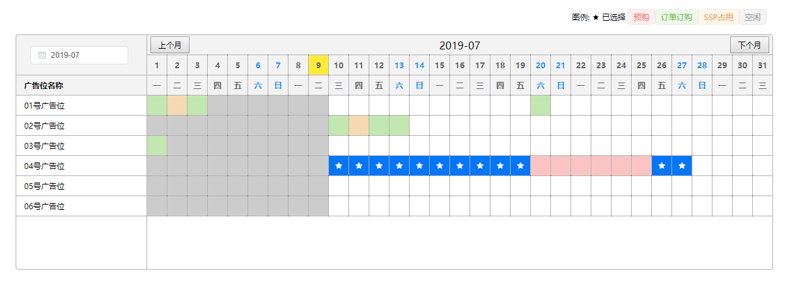

# Schedule 排期表

## 安装
```bash
npm install el-vue-schedule --save
# or
yarn add el-vue-schedule
```

## 使用

1. 引用
全局注册:
```javascript
    import elVueSchedule from  'el-vue-schedule'
    Vue.use(elVueSchedule)
```

按需引用:
```javascript
    import Schedule from  'el-vue-schedule'
    export default {
        components:{
            [Schedule.name]:Schedule
        },
    }

```

2. 模板使用

template:
```html
<template>
    <ac-schedule />
</template>
```

jsx:写法
```jsx
render(){
    return <AcSchedule />
}

```

# Props

参数 | 说明 | 类型 | 默认值
---|---|---|---
title | 列名称 | String | 名称
month | 设置月份如:2019-07 | DateString | 当前月份
rows | 行数数据 | Array | []
cellRender | 自定义绘制单元格 | Function | _


# Events

参数 | 说明 | 返回值
---|---|---
change | 日期变化 | (date:选择的日期,moment格式)


# 示例
[查看>>](https://okool.github.io/el-vue-schedule/dist/)

# 效果图

